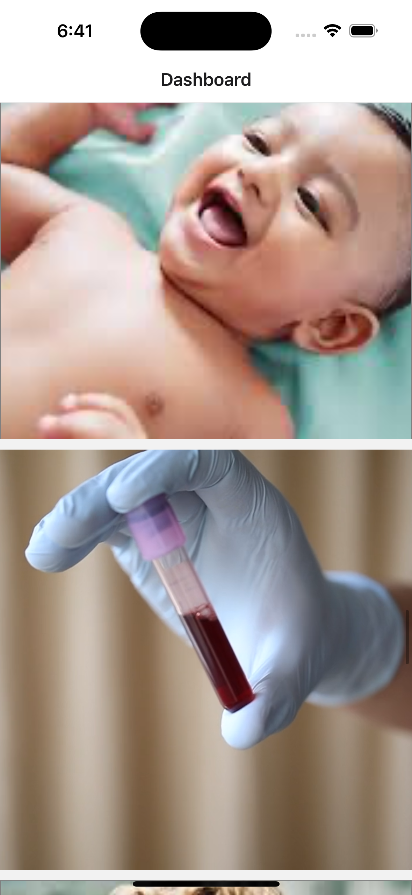

This is a Media demo for Arth Early Learning Spaces.

# Introducation

I will be presenting a demo for Arth Early Learning Spaces. In this demo, I've created a FlatList to display both images and videos. Once the current set of images has been displayed, an API call is triggered to fetch more content and update the list. Essentially, I've implemented pagination to handle the loading of additional data.

## Dashboard

The dashboard is the first page of the application, where a list of images and videos is displayed. On this page, I have also implemented pagination. When the user reaches the end of the list, an API is called to fetch additional content, which is then appended to the existing list.

## Detail page

The detail page is the second page of the application. When a user clicks on an image or video, they are redirected to this page. On the detail page, users have the option to download the image or video.

## Videos

### iOS video

Please review ios video.

